# AWS Serverless RAG Chatbot

A production-grade retrieval-augmented generation (RAG) chatbot built on AWS serverless architecture, leveraging Amazon Bedrock Knowledge Bases and OpenSearch Serverless for semantic document retrieval and AI-powered responses.

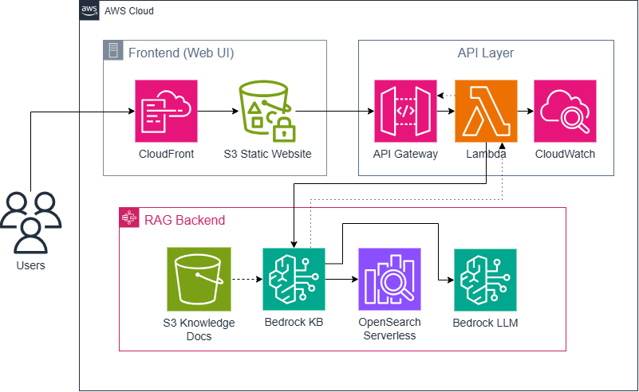

## Overview

This project demonstrates a complete serverless AI application that combines vector search, large language models, and cloud-native infrastructure to deliver intelligent responses grounded in custom knowledge bases. Built entirely with infrastructure as code (Terraform) and designed for scalability, security, and cost-efficiency.

**Tech Stack:** Amazon Bedrock, OpenSearch Serverless, AWS Lambda, API Gateway, S3, CloudFront, Terraform

## Architecture

The system implements a multi-tier serverless architecture:

### Frontend Layer
- **CloudFront CDN**: Global content delivery with HTTPS enforcement
- **S3 Static Hosting**: Secure, private bucket with Origin Access Control (OAC)

### API Layer  
- **API Gateway (HTTP API)**: RESTful endpoint with AWS IAM authentication
- **AWS Lambda**: Serverless compute orchestrating retrieval and generation
- **CloudWatch Logs**: Structured logging with 7-day retention

### RAG Backend
- **Amazon Bedrock Knowledge Base**: Managed document ingestion, chunking, and embedding pipeline
- **OpenSearch Serverless**: Vector similarity search with automatic scaling
- **Bedrock LLM (Claude 3 Haiku)**: Cost-optimized model for response generation
- **S3 Knowledge Docs**: Source document repository

## Key Features

- **Semantic Search**: Vector-based retrieval using Titan Text Embeddings V2
- **Grounded Responses**: Citations from source documents prevent hallucination
- **Secure by Default**: IAM-authenticated API, private S3 buckets, scoped permissions
- **Cost Optimized**: Serverless architecture with no idle compute costs
- **Production Ready**: Request throttling, input validation, comprehensive error handling
- **Infrastructure as Code**: Complete Terraform deployment for reproducibility

## Infrastructure Provisioning

### Prerequisites
- Terraform >= 1.5
- AWS CLI configured with programmatic access
- IAM permissions for Bedrock, Lambda, S3, API Gateway, OpenSearch Serverless

### Deployment Workflow

The infrastructure was built incrementally across multiple commits, each representing a logical architectural layer:

#### 1. Foundation: Storage Layer

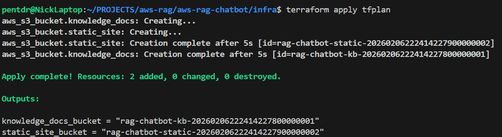

Provisioned two S3 buckets via Terraform:
- `rag-chatbot-static-*`: Frontend hosting with CloudFront integration
- `rag-chatbot-kb-*`: Knowledge base document source
```bash
terraform -chdir=infra plan -out tfplan
terraform -chdir=infra apply tfplan
```

#### 2. Knowledge Base Setup

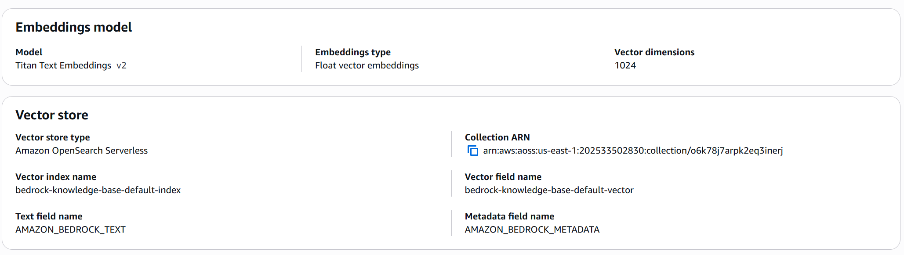

Created Amazon Bedrock Knowledge Base with:
- **Data Source**: S3 bucket with job posting documents
- **Embedding Model**: Titan Text Embeddings V2 (1024 dimensions)
- **Vector Store**: OpenSearch Serverless collection
- **IAM Service Role**: Scoped permissions for S3 read access

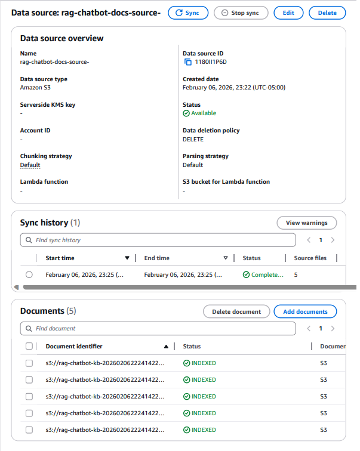

Synchronized 5 cloud engineering job postings, automatically chunked and indexed into vector database.

#### 3. Retrieval Testing

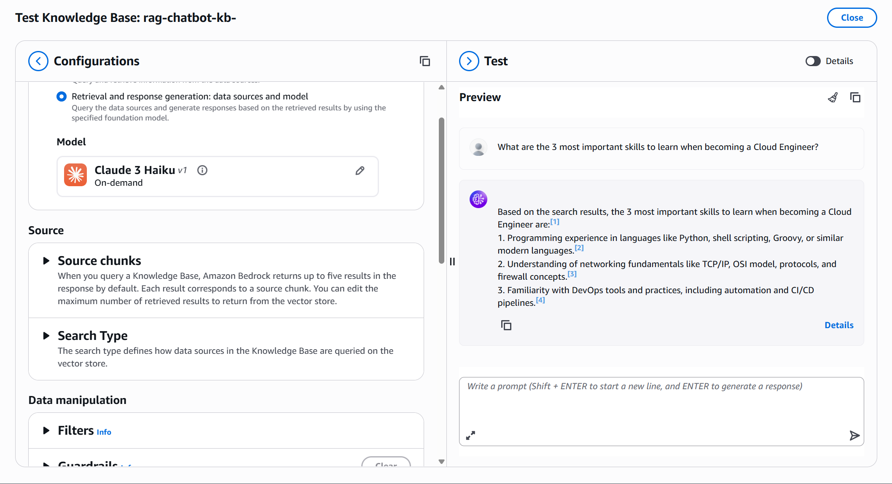

Validated end-to-end retrieval pipeline directly in Bedrock console before Lambda integration. Confirmed semantic search accuracy and citation quality.

#### 4. Compute Layer: Lambda Function

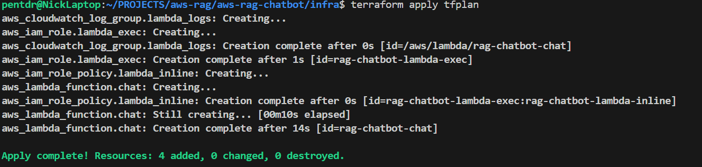

Deployed Python 3.12 Lambda function with:
- **IAM Role**: Least-privilege policies for Bedrock + CloudWatch
- **Environment Variables**: KB ID, model ARN, input limits, CORS origins
- **Logging**: Pre-created log group with 7-day retention
- **Security**: Request size limits (8KB), query length caps (800 chars)

**IAM Policy Structure:**
```terraform
# Scoped CloudWatch Logs (no CreateLogGroup - Terraform manages it)
{
  Effect = "Allow",
  Action = ["logs:CreateLogStream", "logs:PutLogEvents"],
  Resource = "arn:aws:logs:region:account:log-group:/aws/lambda/rag-chatbot-chat:*"
}

# Bedrock Knowledge Base retrieval
{
  Effect = "Allow",
  Action = ["bedrock:Retrieve", "bedrock:RetrieveAndGenerate"],
  Resource = "<kb-arn>"
}

# LLM invocation (scoped to Claude 3 Haiku)
{
  Effect = "Allow",
  Action = ["bedrock:InvokeModel"],
  Resource = "<model-arn>"
}
```

#### 5. Lambda Testing (CLI)

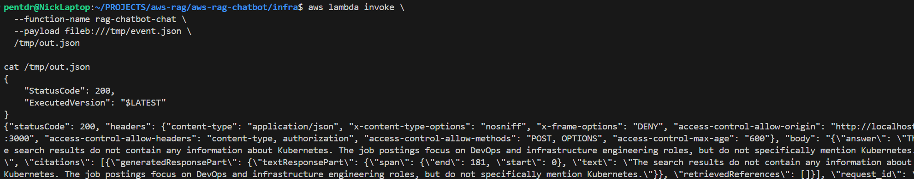

Direct Lambda invocation via AWS CLI confirmed:
- Bedrock Knowledge Base integration working
- Vector retrieval returning relevant chunks
- LLM generating grounded responses with citations
- Structured logging with request IDs

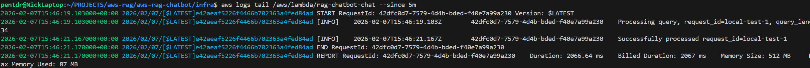

#### 6. API Gateway Integration

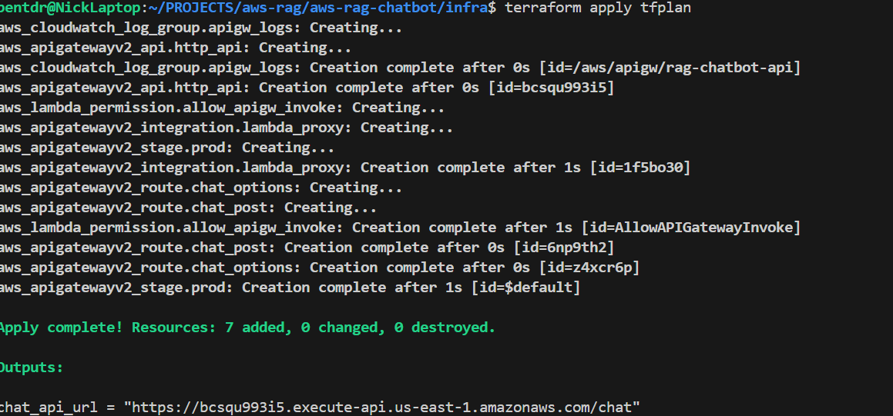

Exposed Lambda via HTTP API v2 with:
- **Authentication**: AWS_IAM (requires SigV4-signed requests)
- **Throttling**: Burst limit 10, rate limit 5 req/sec
- **CORS**: Restricted to localhost origins (dev)
- **Access Logs**: JSON-formatted request/response logging

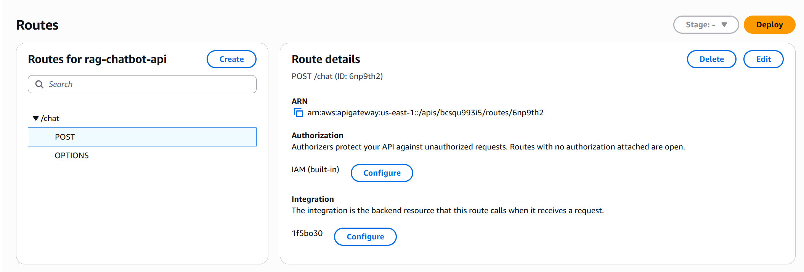

Routes configured:
- `POST /chat` - AWS_IAM auth required
- `OPTIONS /chat` - CORS preflight (no auth)

#### 7. Signed Request Testing

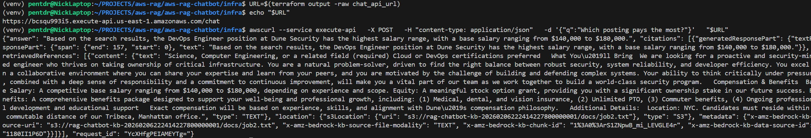

Used `awscurl` for SigV4-signed requests to IAM-authenticated endpoint. Validated:
- End-to-end request flow (User → API GW → Lambda → Bedrock → Response)
- Error handling and status codes
- Citation metadata in responses

#### 8. Frontend Deployment

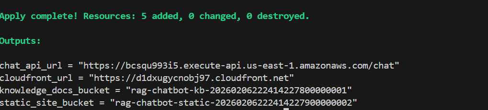

Provisioned static site hosting with:
- **S3 Bucket**: Fully private (all public access blocked)
- **CloudFront Distribution**: Global CDN with HTTPS redirect
- **Origin Access Control**: Modern OAC (not legacy OAI)
- **Bucket Policy**: Scoped to specific CloudFront distribution ARN

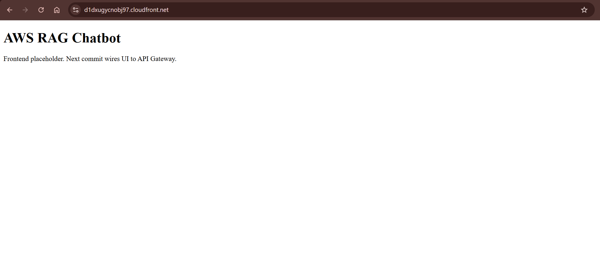

**Security Hardening:**
```terraform
# S3 stays private - no public access
resource "aws_s3_bucket_public_access_block" "static_site" {
  block_public_acls       = true
  block_public_policy     = true
  ignore_public_acls      = true
  restrict_public_buckets = true
}

# CloudFront granted access via service principal + source ARN condition
data "aws_iam_policy_document" "static_bucket_policy" {
  statement {
    principals {
      type        = "Service"
      identifiers = ["cloudfront.amazonaws.com"]
    }
    condition {
      test     = "StringEquals"
      variable = "AWS:SourceArn"
      values   = [aws_cloudfront_distribution.static_site.arn]
    }
  }
}
```

#### 9. Live Demo Queries

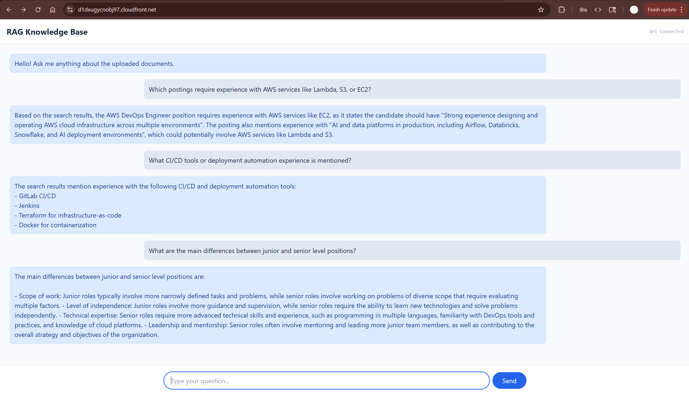

Tested the complete RAG pipeline with real queries against cloud engineering job postings:
- Semantic search across multiple documents
- Accurate citation and source attribution
- Natural language understanding of technical requirements
- Sub-second response times

#### 10. Infrastructure Teardown

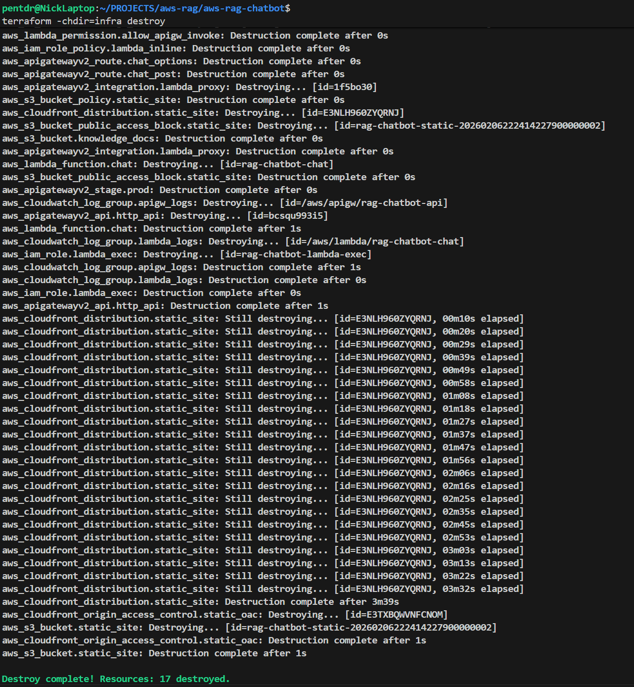

Clean resource cleanup via Terraform destroy, with manual deletion of Bedrock Knowledge Base and OpenSearch Serverless resources to prevent idle costs.

## Security Design

### Defense in Depth
- **API Layer**: AWS IAM authentication prevents anonymous access
- **Lambda**: Input validation (size limits, character limits, origin allowlisting)
- **S3**: Private buckets with explicit CloudFront-only access
- **IAM**: Least-privilege policies scoped to specific resources
- **Network**: HTTPS enforced via CloudFront viewer protocol policy

### Request Flow Security
1. Browser → CloudFront (TLS termination)
2. CloudFront → S3 (authenticated via OAC)
3. UI → API Gateway (requires SigV4 signature)
4. API Gateway → Lambda (verified via execution role)
5. Lambda → Bedrock (scoped to specific KB + model)

### Error Handling
- Generic error messages to client (no stack trace leakage)
- Detailed errors logged server-side with request IDs
- Structured exception handling (JSONDecodeError, ClientError, generic Exception)

## Cost Analysis

**Architecture designed for cost efficiency:**

| Component | Pricing Model | Demo Cost |
|-----------|---------------|-----------|
| S3 Storage | $0.023/GB | ~$0.01 |
| Lambda | $0.20/1M requests | ~$0.05 |
| API Gateway | $1.00/1M requests | ~$0.10 |
| Bedrock Embeddings | Per token | ~$0.10 |
| Bedrock LLM (Haiku) | $0.25/$1.25 per 1M tokens | ~$0.50 |
| OpenSearch Serverless | ~$0.24/OCU/hour | ~$2-5* |
| CloudFront | $0.085/GB | ~$0.05 |
| CloudWatch Logs | $0.50/GB | ~$0.01 |

**Total demo cost: ~$3-6** for full build + testing cycle

*\*OpenSearch Serverless is the primary cost driver even at minimal scale. Torn down immediately after screenshots to prevent idle charges.*

## Lessons Learned

### Technical Challenges
1. **Bedrock IAM Permissions**: `bedrock:RetrieveAndGenerate` internally requires both `bedrock:Retrieve` and `bedrock:InvokeModel` permissions. Initial AccessDenied errors resolved by splitting into separate policy statements.

2. **OpenSearch Serverless Provisioning**: Multiple KB creation failures due to leftover security policies from previous attempts. Required manual cleanup of encryption/network/data access policies between iterations.

3. **Region Consistency**: S3 bucket and Bedrock KB must be in same region (us-east-1). Cross-region configuration caused 301 redirect errors during document sync.

4. **CloudFront Propagation Time**: Distribution creation took ~35 minutes. Planned infrastructure commits to account for this delay in build timeline.

### Best Practices Applied
- **Incremental Infrastructure**: Each Terraform commit represents one architectural layer for clear history
- **Security First**: Started with IAM auth and private resources, not as an afterthought
- **Observability**: CloudWatch logging configured before testing, not retroactively
- **Cost Awareness**: Documented cost drivers and destruction workflow to prevent surprise bills

## Project Structure
```
aws-rag-chatbot/
├── README.md
├── .gitignore
├── architecture/
│   └── architecture.png
├── screenshots/
│   ├── s3-deployment.png
│   ├── kb-overview.png
│   ├── kb-sync-complete.png
│   ├── kb-retrieval-test.png
│   ├── lambda-deployment.png
│   ├── lambda-handler-test.png
│   ├── cloudwatch-log-test.png
│   ├── api-deployment.png
│   ├── api-routes.png
│   ├── api-query-test.png
│   ├── cloudfront-deployment.png
│   ├── cloudfront-browser-placeholder.png
│   ├── demo-queries.png
│   └── destruction.png
├── infra/
│   ├── providers.tf
│   ├── variables.tf
│   ├── versions.tf
│   ├── s3.tf
│   ├── lambda.tf
│   ├── api.tf
│   ├── frontend.tf
│   └── outputs.tf
├── lambda/
│   └── handler.py
└── web/
    ├── index.html
    ├── .gitignore
    ├── public/
    │   └── config.json
    └── src/
        └── main.js
```

## Deployment Steps

### 1. Clone and Configure
```bash
git clone https://github.com/nmpape11/aws-rag-chatbot
cd aws-rag-chatbot

# Set Terraform variables (do not commit)
cat > .env <<EOF
TF_VAR_kb_id=YOUR_KB_ID
TF_VAR_kb_arn=arn:aws:bedrock:us-east-1:ACCOUNT:knowledge-base/YOUR_KB_ID
TF_VAR_model_arn=arn:aws:bedrock:us-east-1::foundation-model/anthropic.claude-3-haiku-20240307-v1:0
EOF

# Load variables
set -a && source .env && set +a
```

### 2. Deploy Infrastructure
```bash
terraform -chdir=infra init
terraform -chdir=infra plan -out tfplan
terraform -chdir=infra apply tfplan
```

### 3. Create Knowledge Base (Console)
- Navigate to Amazon Bedrock → Knowledge Bases → Create
- Configure S3 data source (bucket from Terraform output)
- Select Titan Text Embeddings V2
- Create OpenSearch Serverless collection
- Run sync and wait for completion

### 4. Test Backend
```bash
# Get API URL
URL=$(terraform -chdir=infra output -raw chat_api_url)

# Signed request (requires awscurl)
pip install awscurl
awscurl --service execute-api \
  -X POST \
  -H "content-type: application/json" \
  -d '{"q":"Which posting mentions Kubernetes?"}' \
  "$URL"
```

### 5. Deploy Frontend
```bash
# Update config.json with API URL
echo "{\"apiUrl\":\"$URL\"}" > web/public/config.json

# Upload to S3
aws s3 sync web/ s3://$(terraform -chdir=infra output -raw static_site_bucket)/

# Get CloudFront URL
terraform -chdir=infra output cloudfront_url
```

## Teardown
```bash
# Destroy Terraform-managed resources
terraform -chdir=infra destroy

# Manually delete (via console):
# 1. Bedrock Knowledge Base
# 2. OpenSearch Serverless collection + security policies
```

## Future Enhancements

- [ ] Cognito user pools for browser-based authentication
- [ ] DynamoDB for conversation history persistence
- [ ] Lambda@Edge for request signing in browser
- [ ] Multi-document upload UI
- [ ] Real-time streaming responses via WebSocket API
- [ ] Cost alerts via CloudWatch + SNS
- [ ] CI/CD pipeline with GitHub Actions

## License

MIT

## Acknowledgments

Built as a portfolio demonstration of serverless AI architecture on AWS. Not intended for production use without additional hardening (KMS encryption, VPC isolation, WAF rules, etc.).